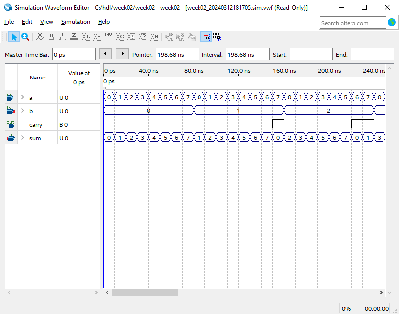
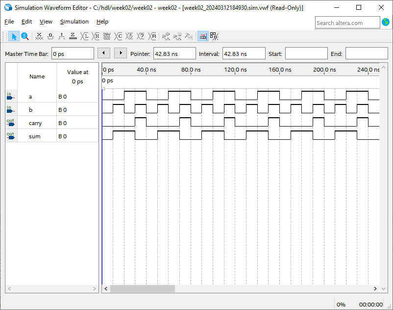
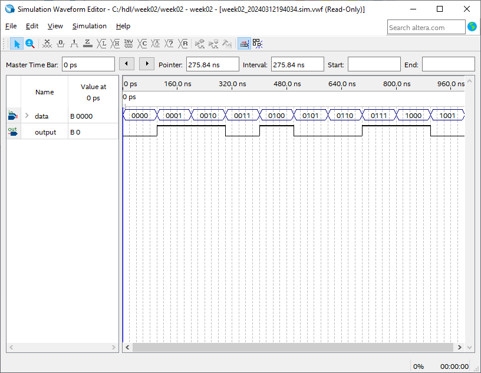

= HDL Week 2
:source-highlighter: pygments

[.text-center]
Jochem Arends (485637)

== Self Test Chapter 3

[source,vhdl]
----
architecture arch of gate_network is
begin
-- concurrent assignment statements operate in parallel
-- d(1) selects bit 1 of standard logic vector D
    x <= a and not(b or c) and (d(1) xor d(2));
-- srocess must declare a sensitivity list
-- sensitivity list includes all signals which can change the outputs
    process (a, b, c, d)
    begin
    -- statements inside a process execute in sequential order
        y <= a and not(b OR c) and (d(1) xor d(2));
    end process;
end arch;
----

[qanda]
Is this a structural, behavioral, or RTL description?::
This is a RTL description cause the circuit is described in the relationship between signals.

What is the purpose of a generic?::
The purpose of generics is to create flexible components.

What is the purpose of a configuration statement?::
`TODO`

In our tutorial there is an adder, is this a structural, behavioral, or RTL description?::
The adder from the tutorial uses a RTL description because the behaviour is described in terms of relationships between signals.

Draw the schematics of a full adder and make a structural VHDL description::
`TODO`

== Exercises Chapter 3

[qanda]
Simulate in Quartus the behavioral VHDL of a 3-bit adder.::
I have pasted an image of the simulation at the end of this document.

Implement the 3-bit adder on the MAX 10 board.::
I have no access to such board at the moment.

Simulate in Quartus a structural description of a half adder.::
I have pasted an image of the simulation at the end of this document.

== Self Test Chapter 4

[source,vhdl]
----
architecture arch of gate_network is
begin
    x <= a and not(b or c) and (d(1) xor d(2));
    y <= (d(1) xor d(2));
end
----

[qanda]

Which value, `x` or `y` is first evaluated?::
They are executed simultaneously since signal assignment is concurrent.

Give the behavioral description of a 2 to 4 decoder.::
[source,vhdl]
----
include::decoder.vhd[]
----

== Exercises Chapter 4

[qanda]
Simulate the behavioral description of a 2 to 4 decoder in Quartus.::
I have pasted an image of the simulation at the end of this document.

Implement the 2 to 4 decoder on the Danjel board::
I have no access to such board at the moment.

== Self Test Chapter 5

[qanda]
What does a concurrent assignment mean?::
Concurrent assignment means that the assignment is happening at the same time to something else.

== Exercises Chapter 5

[qanda]
Simulate the 7 segments display model.::
`TODO`

Design a 4-bit even parity checker (structured) and simulate it.::
The source code is put below and the simulation results can be found at the end of this document.

Implement the parity checker and the 7 segm display on the max 10 board::
I have no access to such board at the moment.

[source,vhdl]
----
include::parity_checker.vhd[]
----

<<<

== Simulation Results

.Simulation of Behavioral Half Adder

.Simulation of Structural Half Adder

.Simulation of Even Parity Checker

