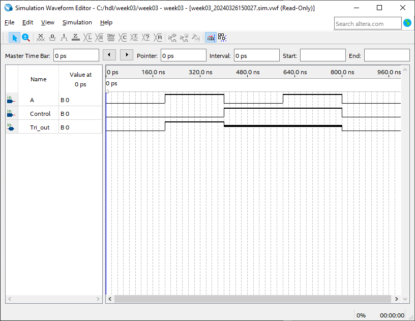
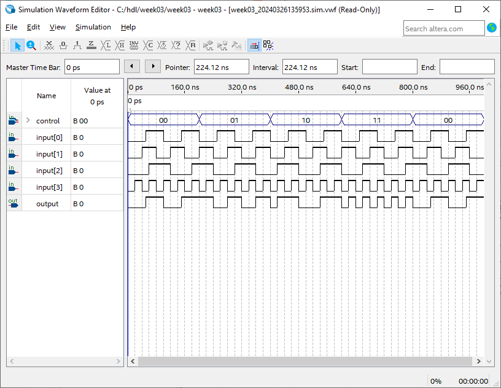
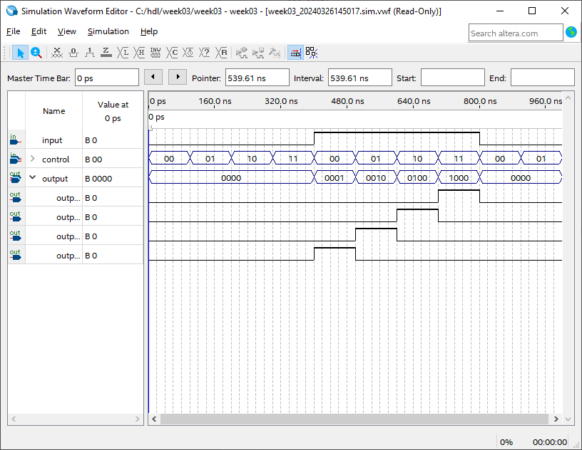

= HDL Week 3
:source-highlighter: pygments

[.text-center]
Jochem Arends (495637)

== Exercises Chapter 6

[qanda]
Design and simulate a behavioral description of a 4-to-1 multiplexer.::
I've pasted the simulation result at the end of this document.
It might be difficult to see, but the multiplexer generates the correct output signal.
+
[source,vhdl]
----
include::src/mux_behavioral.vhd[]
----

Implement the 4-to-1 multiplexer on the max 10 board.::
`TODO`

Design and simulate a structural description of a 1-to-4 demultiplexer.::
I've pasted the simulation result at the end of this document.
+
[source,vhdl]
----
include::src/demux.vhd[]
----

Connect the two description in a block diagram and give a good simulation.::
`TODO`

== Self Test Chapter 7

[qanda]
When is a tri-state needed?::
A tri-state buffer may be needed when connecting multiple signals to a commmon bus.

== Exercises Chapter 7

[qanda]
Simulate in Quartus the tristate model given in this chapter.::
+

Design and simulate an 8-bit tri-state buffer.::
[source,vhdl]
----
include::src/tristate.vhd[]
----

== Self Test Chapter 8

[qanda]
Why is it not advisable to gate a signal with the clock?::
Because the clock signal might not be in a stable state.
An example of this is during a rising or falling edge.

Describe the difference working of the two next descriptions of a flip flop.::
+
.First Description
[source,vhdl]
----
process (reset, clock)
begin
    if reset = '1' then
        q <= '0';
    elsif clock'EVENT and clock = '1' then
        q <= data;
    end if;
end process;
----
+
.Second Description
[source,vhdl]
----
process (clock)
begin
    if reset = '1' then
        q <= '0';
    elsif clock'EVENT and clock = '1' then
        q <= data;
    end if;
end process;
----
+
The first description has both `reset` and `clock` in its priority list while the second description only has `clock` in its priority list.
For the first description, the process statement gets evaluated when `reset` or `clock` changes.
This flip flop uses an asynchronous reset.
For the second description, the process statement only gets evaluated when `clock` changes.
This flip flop resets when the `reset` signal is high when `clock` changes.

<<<

== Exercises Chapter 8

[qanda]
Write VHDL for an 8-bit D-flipflop register (with a negative).::
+
[source,vhdl]
----
include::src/reg.vhd[]
----

<<<

== Simulation Results

.Simulation of Behavioral 4-to-1 Multiplexer

.Simulation of Structural 1-to-4 Demultiplexer

.Simulation of Tristate from Reader

