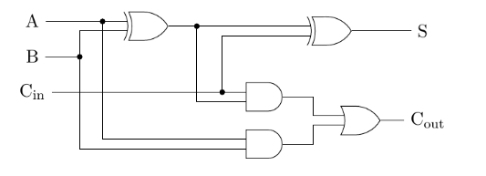

= HDL Week 2
:source-highlighter: pygments

[.text-center]
Jochem Arends (495637)

== Self Test Chapter 3

[source,vhdl]
----
include::self-test-ch3.vhd[]
----

[qanda]
Is this a structural, behavioral, or RTL description?::
This is a RTL description cause the circuit is described in the relationship between signals.

What is the purpose of a generic?::
The purpose of generics is to create flexible components.

What is the purpose of a configuration statement?::
-

In our tutorial there is an adder, is this a structural, behavioral, or RTL description?::
The adder from the tutorial is defined using a RTL description.
The behaviour is described in terms of relationships between signals.

Draw the schematics of a full adder and make a structural VHDL description:: +

== Self Test Chapter 4

[source,vhdl]
----
include::../../../idev/hdl/week2/week2.vhd[]
----

